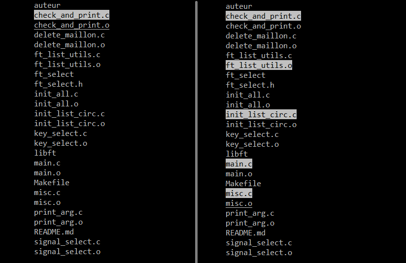

# Ft_select

Ce projet de l'école 42, à réaliser seul, est un programme en termcaps qui retournera à votre shell les arguments sélectionnés à l'aide de la barre d'espace parmi une liste au lancement de ce dernier.

## install & usage

~~~sh
git clone https://github.com/kaboff/ft_select.git ~/ft_select
cd ~/ft_select && make
~~~

~~~sh
./ft_select [Arguments...]
~~~

### Touche du clavier

- Flèche du haut - Monter

- Flèche du bas - Descendre

- Barre d'espace - Sélectionner un élément

- Touche effacer - Supprimer un élément

- Touche Entrée - Retourner les éléments sélectionnés au shell
